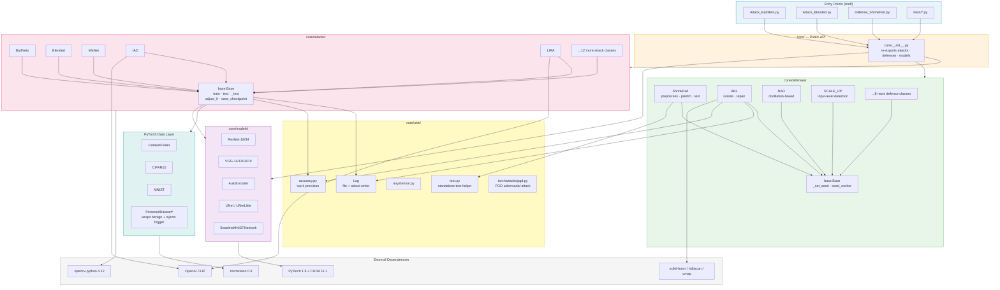

# BackdoorBox Architecture Flowchart

```mermaid
flowchart TD
    subgraph EntryPoints["Entry Points (root/)"]
        EP1[Attack_BadNets.py]
        EP2[Attack_Blended.py]
        EP3[Defense_ShrinkPad.py]
        EP4[tests/*.py]
    end

    subgraph CorePackage["core/ — Public API"]
        CINIT[core/__init__.py\nre-exports attacks · defenses · models]
    end

    subgraph AttacksLayer["core/attacks/"]
        ABASE[base.Base\ntrain · test · _test\nadjust_lr · save_checkpoint]
        BADNETS[BadNets]
        BLENDED[Blended]
        WANET[WaNet]
        IAD[IAD]
        LIRA[LIRA]
        OTHERS_A[...12 more attack classes]
    end

    subgraph DefensesLayer["core/defenses/"]
        DBASE[base.Base\n_set_seed · seed_worker]
        SHRINKPAD[ShrinkPad\npreprocess · predict · test]
        ABL[ABL\nisolate · repair]
        NAD[NAD\ndistillation-based]
        SCALEUP[SCALE_UP\ninput-level detection]
        OTHERS_D[...8 more defense classes]
    end

    subgraph ModelsLayer["core/models/"]
        RESNET[ResNet-18/34]
        VGG[VGG-11/13/16/19]
        AE[AutoEncoder]
        UNET[UNet / UNetLittle]
        MNIST_NET[BaselineMNISTNetwork]
    end

    subgraph UtilsLayer["core/utils/"]
        LOG[Log\nfile + stdout writer]
        ACCURACY[accuracy.py\ntop-k precision]
        ANY2T[any2tensor.py]
        TEST[test.py\nstandalone test helper]
        TORCHATTACKS[torchattacks/pgd.py\nPGD adversarial attack]
    end

    subgraph DataLayer["PyTorch Data Layer"]
        DSFOLDER[DatasetFolder]
        CIFAR10_DS[CIFAR10]
        MNIST_DS[MNIST]
        POISONED[PoisonedDataset*\nwraps benign + injects trigger]
    end

    subgraph ExternalDeps["External Dependencies"]
        PYTORCH[PyTorch 1.8 + CUDA 11.1]
        TORCHVISION[torchvision 0.9]
        OPENCV[opencv-python 4.12]
        CLIP[OpenAI CLIP]
        SKLEARN[scikit-learn / hdbscan / umap]
    end

    EP1 & EP2 & EP3 & EP4 --> CINIT
    CINIT --> AttacksLayer
    CINIT --> DefensesLayer
    CINIT --> ModelsLayer

    BADNETS & BLENDED & WANET & IAD & LIRA & OTHERS_A --> ABASE
    SHRINKPAD & ABL & NAD & SCALEUP & OTHERS_D --> DBASE

    ABASE --> LOG & ACCURACY
    ABASE --> DataLayer
    ABASE --> ModelsLayer

    SHRINKPAD --> TEST
    ABL --> LOG & ACCURACY

    DataLayer --> TORCHVISION
    ModelsLayer --> PYTORCH
    AttacksLayer --> OPENCV
    LIRA & IAD --> CLIP
    ABL --> SKLEARN

    style EntryPoints fill:#e8f4f8,stroke:#2196F3
    style CorePackage fill:#fff3e0,stroke:#FF9800
    style AttacksLayer fill:#fce4ec,stroke:#E91E63
    style DefensesLayer fill:#e8f5e9,stroke:#4CAF50
    style ModelsLayer fill:#f3e5f5,stroke:#9C27B0
    style UtilsLayer fill:#fff9c4,stroke:#FBC02D
    style DataLayer fill:#e0f2f1,stroke:#009688
    style ExternalDeps fill:#f5f5f5,stroke:#9E9E9E
```
