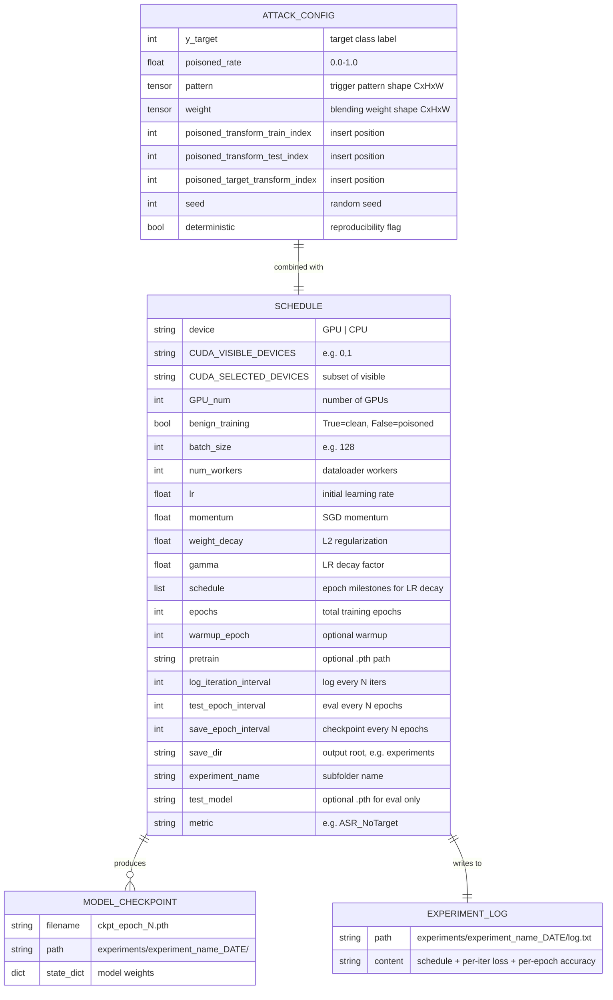

# BackdoorBox Class Hierarchy & Data Model

## Class Hierarchy (UML-style)

```mermaid
classDiagram
    class AttackBase {
        +train_dataset
        +test_dataset
        +model: nn.Module
        +loss: nn.Module
        +global_schedule: dict
        +current_schedule: dict
        +poisoned_train_dataset
        +poisoned_test_dataset
        +__init__(train_dataset, test_dataset, model, loss, schedule, seed, deterministic)
        +train(schedule)
        +test(schedule, model, test_dataset, poisoned_test_dataset)
        +get_model() nn.Module
        +get_poisoned_dataset() tuple
        -_set_seed(seed, deterministic)
        -_seed_worker(worker_id)
        -_test(dataset, device, batch_size, num_workers)
        +adjust_learning_rate(optimizer, epoch, step, len_epoch)
    }

    class DefenseBase {
        +__init__(seed, deterministic)
        -_set_seed(seed, deterministic)
    }

    class BadNets {
        +y_target: int
        +poisoned_rate: float
        +pattern: Tensor
        +weight: Tensor
        +__init__(train_dataset, test_dataset, model, loss, y_target, poisoned_rate, pattern, weight, ...)
    }

    class Blended {
        +y_target: int
        +poisoned_rate: float
        +pattern: Tensor
        +weight: Tensor
        +__init__(...)
    }

    class WaNet {
        +y_target: int
        +poisoned_rate: float
        +identity_grid: Tensor
        +noise_grid: Tensor
        +__init__(...)
    }

    class IAD {
        +y_target: int
        +poisoned_rate: float
        +__init__(...)
        +train(schedule)
    }

    class ShrinkPad {
        +global_size_map: int
        +global_pad: int
        +current_size_map: int
        +current_pad: int
        +preprocess(data, size_map, pad) Tensor
        +predict(model, data, schedule) Tensor
        +test(model, dataset, schedule)
    }

    class ABL {
        +__init__(train_dataset, test_dataset, model, loss, ...)
        +train(schedule)
    }

    class NAD {
        +__init__(train_dataset, test_dataset, model, loss, ...)
        +repair(schedule, transform)
    }

    class SCALE_UP {
        +__init__(model, defense_frac, ...)
        +detect(test_dataset) list
    }

    class AddTrigger {
        +res: Tensor
        +weight: Tensor
        +add_trigger(img) Tensor
    }

    class AddDatasetFolderTrigger {
        +pattern: Tensor
        +__call__(img) Tensor
    }

    class AddMNISTTrigger {
        +pattern: Tensor
        +__call__(img) Tensor
    }

    class AddCIFAR10Trigger {
        +pattern: Tensor
        +__call__(img) Tensor
    }

    class ModifyTarget {
        +y_target: int
        +__call__(y) int
    }

    class PoisonedDatasetFolder {
        +poisoned_set: frozenset
        +poisoned_transform: Compose
        +poisoned_target_transform: Compose
        +__getitem__(index) tuple
    }

    class PoisonedMNIST {
        +poisoned_set: frozenset
        +poisoned_transform: Compose
        +poisoned_target_transform: Compose
        +__getitem__(index) tuple
    }

    class PoisonedCIFAR10 {
        +poisoned_set: frozenset
        +poisoned_transform: Compose
        +poisoned_target_transform: Compose
        +__getitem__(index) tuple
    }

    AttackBase <|-- BadNets
    AttackBase <|-- Blended
    AttackBase <|-- WaNet
    AttackBase <|-- IAD
    AttackBase <|-- LIRA
    AttackBase <|-- Blind
    AttackBase <|-- ISSBA
    AttackBase <|-- SleeperAgent
    AttackBase <|-- BATT
    AttackBase <|-- AdaptivePatch
    AttackBase <|-- BAAT

    DefenseBase <|-- ShrinkPad
    DefenseBase <|-- ABL
    DefenseBase <|-- NAD
    DefenseBase <|-- SCALE_UP
    DefenseBase <|-- REFINE
    DefenseBase <|-- FLARE
    DefenseBase <|-- FineTuning
    DefenseBase <|-- Pruning
    DefenseBase <|-- MCR

    AddTrigger <|-- AddDatasetFolderTrigger
    AddTrigger <|-- AddMNISTTrigger
    AddTrigger <|-- AddCIFAR10Trigger

    DatasetFolder <|-- PoisonedDatasetFolder
    MNIST <|-- PoisonedMNIST
    CIFAR10 <|-- PoisonedCIFAR10

    BadNets ..> PoisonedDatasetFolder : creates
    BadNets ..> PoisonedMNIST : creates
    BadNets ..> PoisonedCIFAR10 : creates
    PoisonedDatasetFolder ..> AddDatasetFolderTrigger : uses
    PoisonedDatasetFolder ..> ModifyTarget : uses
    PoisonedMNIST ..> AddMNISTTrigger : uses
    PoisonedCIFAR10 ..> AddCIFAR10Trigger : uses
```

## Schedule Configuration Data Model

```mermaid
erDiagram
    SCHEDULE {
        string device "GPU | CPU"
        string CUDA_VISIBLE_DEVICES "e.g. 0,1"
        string CUDA_SELECTED_DEVICES "subset of visible"
        int GPU_num "number of GPUs"
        bool benign_training "True=clean, False=poisoned"
        int batch_size "e.g. 128"
        int num_workers "dataloader workers"
        float lr "initial learning rate"
        float momentum "SGD momentum"
        float weight_decay "L2 regularization"
        float gamma "LR decay factor"
        list schedule "epoch milestones for LR decay"
        int epochs "total training epochs"
        int warmup_epoch "optional warmup"
        string pretrain "optional .pth path"
        int log_iteration_interval "log every N iters"
        int test_epoch_interval "eval every N epochs"
        int save_epoch_interval "checkpoint every N epochs"
        string save_dir "output root, e.g. experiments"
        string experiment_name "subfolder name"
        string test_model "optional .pth for eval only"
        string metric "e.g. ASR_NoTarget"
    }

    ATTACK_CONFIG {
        int y_target "target class label"
        float poisoned_rate "0.0-1.0"
        tensor pattern "trigger pattern shape CxHxW"
        tensor weight "blending weight shape CxHxW"
        int poisoned_transform_train_index "insert position"
        int poisoned_transform_test_index "insert position"
        int poisoned_target_transform_index "insert position"
        int seed "random seed"
        bool deterministic "reproducibility flag"
    }

    MODEL_CHECKPOINT {
        string filename "ckpt_epoch_N.pth"
        string path "experiments/experiment_name_DATE/"
        dict state_dict "model weights"
    }

    EXPERIMENT_LOG {
        string path "experiments/experiment_name_DATE/log.txt"
        string content "schedule + per-iter loss + per-epoch accuracy"
    }

    SCHEDULE ||--o{ MODEL_CHECKPOINT : "produces"
    SCHEDULE ||--|| EXPERIMENT_LOG : "writes to"
    ATTACK_CONFIG ||--|| SCHEDULE : "combined with"
```
