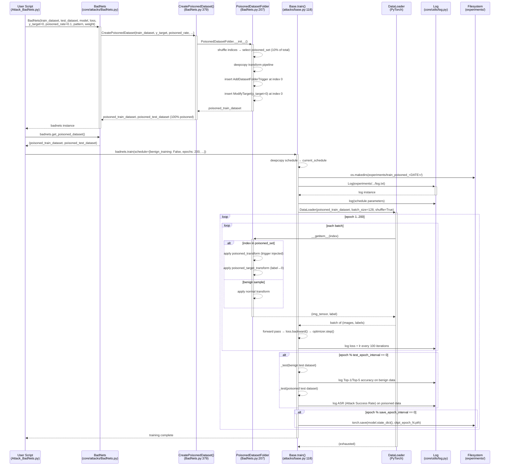

# BackdoorBox Key Flow: BadNets Poisoned Training Sequence

```mermaid
sequenceDiagram
    participant U as User Script<br/>(Attack_BadNets.py)
    participant BN as BadNets<br/>(core/attacks/BadNets.py)
    participant CPD as CreatePoisonedDataset()<br/>(BadNets.py:379)
    participant PDS as PoisonedDatasetFolder<br/>(BadNets.py:207)
    participant BASE as Base.train()<br/>(attacks/base.py:118)
    participant DL as DataLoader<br/>(PyTorch)
    participant LOG as Log<br/>(core/utils/log.py)
    participant FS as Filesystem<br/>(experiments/)

    U->>+BN: BadNets(train_dataset, test_dataset, model, loss,<br/>y_target=0, poisoned_rate=0.1, pattern, weight)
    BN->>+CPD: CreatePoisonedDataset(train_dataset, y_target, poisoned_rate, ...)
    CPD->>+PDS: PoisonedDatasetFolder.__init__()
    PDS-->>PDS: shuffle indices → select poisoned_set (10% of total)
    PDS-->>PDS: deepcopy transform pipeline
    PDS-->>PDS: insert AddDatasetFolderTrigger at index 0
    PDS-->>PDS: insert ModifyTarget(y_target=0) at index 0
    PDS-->>-CPD: poisoned_train_dataset
    CPD-->>-BN: poisoned_train_dataset, poisoned_test_dataset (100% poisoned)
    BN-->>-U: badnets instance

    U->>BN: badnets.get_poisoned_dataset()
    BN-->>U: (poisoned_train_dataset, poisoned_test_dataset)

    U->>+BASE: badnets.train(schedule={benign_training: False, epochs: 200, ...})
    BASE-->>BASE: deepcopy schedule → current_schedule
    BASE->>FS: os.makedirs(experiments/train_poisoned_<DATE>/)
    BASE->>+LOG: Log(experiments/.../log.txt)
    LOG-->>-BASE: log instance
    BASE->>LOG: log(schedule parameters)

    BASE->>+DL: DataLoader(poisoned_train_dataset, batch_size=128, shuffle=True)

    loop epoch 1..200
        loop each batch
            DL->>+PDS: __getitem__(index)
            alt index in poisoned_set
                PDS-->>PDS: apply poisoned_transform (trigger injected)
                PDS-->>PDS: apply poisoned_target_transform (label→0)
            else benign sample
                PDS-->>PDS: apply normal transform
            end
            PDS-->>-DL: (img_tensor, label)
            DL-->>BASE: batch of (images, labels)
            BASE-->>BASE: forward pass → loss.backward() → optimizer.step()
            BASE->>LOG: log loss + lr every 100 iterations
        end

        alt epoch % test_epoch_interval == 0
            BASE-->>BASE: _test(benign test dataset)
            BASE->>LOG: log Top-1/Top-5 accuracy on benign data
            BASE-->>BASE: _test(poisoned test dataset)
            BASE->>LOG: log ASR (Attack Success Rate) on poisoned data
        end

        alt epoch % save_epoch_interval == 0
            BASE->>FS: torch.save(model.state_dict(), ckpt_epoch_N.pth)
        end
    end

    BASE-->>-U: training complete
    DL-->>-BASE: (exhausted)
```
